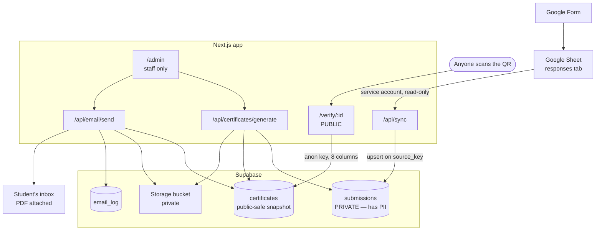
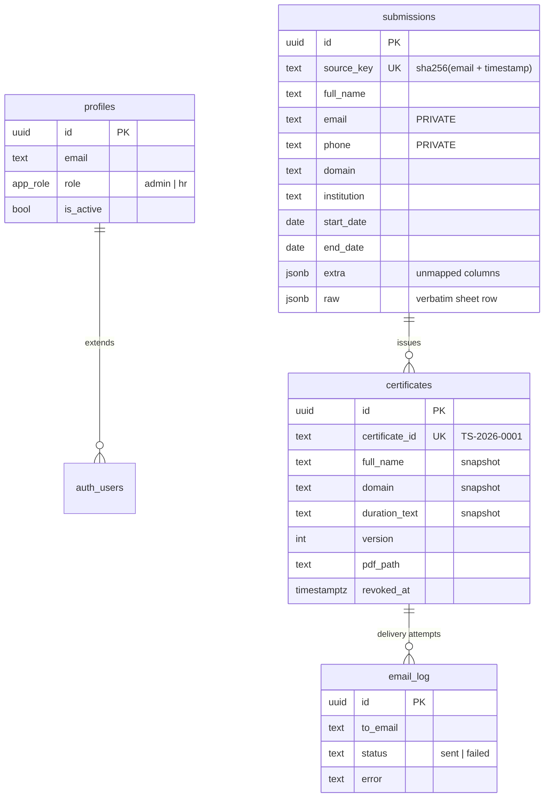
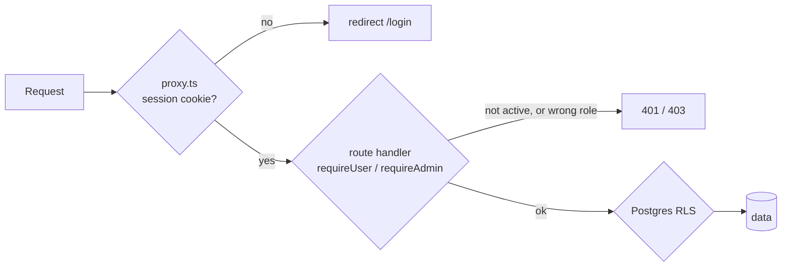
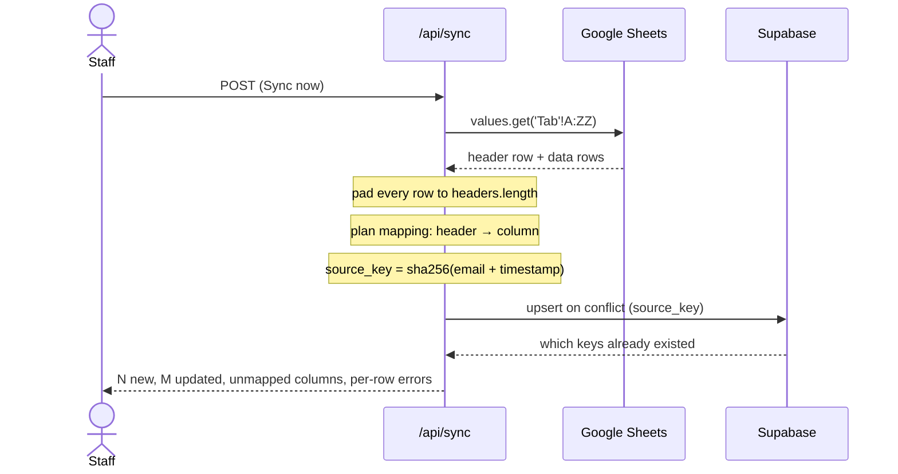
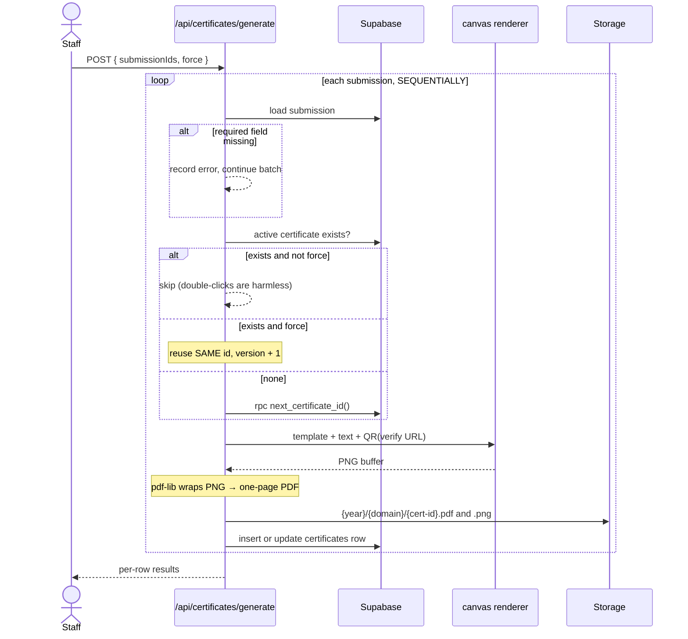
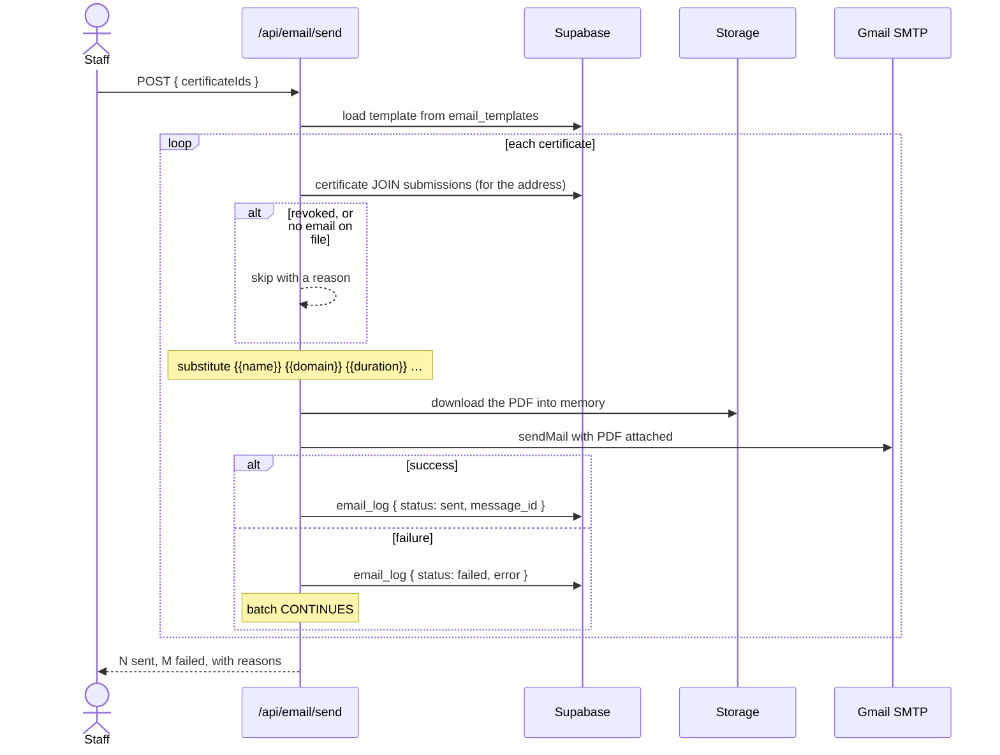
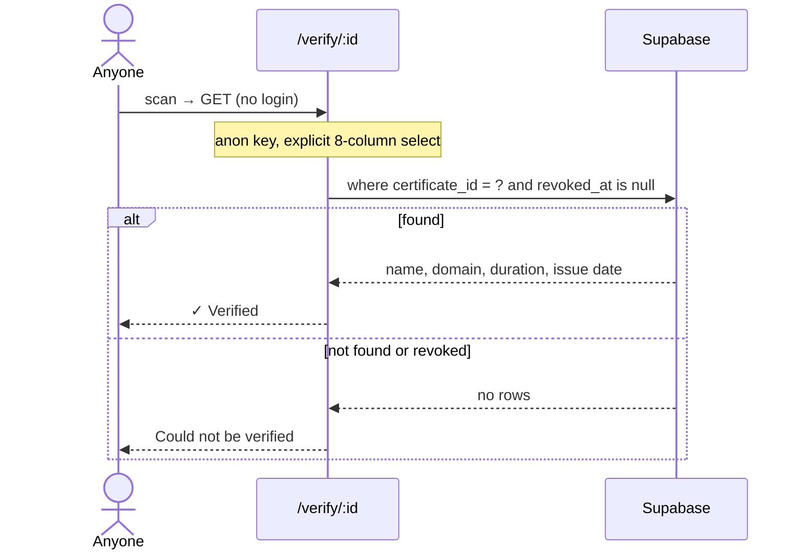

# Architecture

How TS-Certify works inside — the data model, the security model, and what happens on each button press.

---

## 1. The whole system



The single most important line on that diagram is the last one: the public page reads `certificates`, never `submissions`.

---

## 2. Data model

Five tables. The split between the first two is the backbone of the whole design.



### Why `submissions` and `certificates` are separate tables

Not normalisation — **security**.

`submissions` holds email, phone, and a verbatim dump of the entire form row. None of it may ever reach a browser.

`certificates` holds only what is *printed on the document*, which is public by definition — the student is going to show it to employers.

So the public verify page reads a table that contains **no sensitive column at all**. Even a careless `select('*')` there cannot leak a phone number, because there is no phone number in that table.

A second benefit falls out of the split: `certificates` is a **snapshot**, frozen at issue time. If you correct a spelling in the Sheet next month, an already-issued certificate does not silently change underneath the person holding it. Only a deliberate **Re-generate** refreshes it.

### Certificate IDs

```sql
insert into certificate_counters (year, last_seq) values (2026, 1)
on conflict (year) do update set last_seq = certificate_counters.last_seq + 1
returning last_seq;
```

`INSERT … ON CONFLICT DO UPDATE … RETURNING` takes a row lock for the duration of the statement. Two people clicking Generate at the same instant serialise and receive 1 and 2 — they cannot both read the same number. The `UNIQUE` constraint on `certificate_id` is the backstop that would surface any future bug immediately rather than quietly issuing duplicates.

The year comes from `now() at time zone 'Asia/Kolkata'`, so the sequence rolls over at local midnight rather than at 05:30.

### One active certificate per student

```sql
create unique index certificates_one_active_per_submission
  on certificates (submission_id) where revoked_at is null;
```

A *partial* index. It permits any number of revoked rows but only one live one — which is what makes "revoke, then re-issue under a new ID" work without deleting the audit trail.

---

## 3. Security model

### Three layers, and none of them is the only one



`proxy.ts` is a **gate, not the boundary**. It cannot see roles — those live in the database — and middleware alone is the kind of thing that gets bypassed. Every page and route re-checks server-side via `src/lib/auth.ts`.

This was tested rather than assumed. All six API endpoints were probed three ways: with no cookie (307 → `/login`), with a forged session cookie (blocked), and with a **real session belonging to a deactivated account** — which the proxy happily passes through and the handler refuses with 401.

### Row Level Security

RLS is enabled on **every** table. Four of them have **no policies at all**, which in Postgres means default-deny for both `anon` and `authenticated`.

```sql
-- The ONLY public read in the entire application:
create policy "anon reads active certificates" on certificates
  for select to anon using (revoked_at is null);

-- Column-level defence in depth on top of it:
revoke select on certificates from anon;
grant select (certificate_id, full_name, domain, start_date, end_date,
              duration_text, issued_on, revoked_at) on certificates to anon;
```

That is why `NEXT_PUBLIC_SUPABASE_ANON_KEY` is safe to ship to browsers. It is public, and it can read exactly eight columns of one table.

### Three clients, deliberately different

| Client | Key | Used by | Can read |
|---|---|---|---|
| `supabase/admin.ts` | `service_role` | Admin pages, API routes | Everything — bypasses RLS |
| `supabase/server.ts` | `anon` + cookies | Working out *who* is asking | Only the caller's own profile |
| `supabase/public.ts` | `anon` | `/verify/:id` | Eight columns of `certificates` |

The verify page uses the **anon** client on purpose. Using a service-role key on a page reachable by the entire internet is exactly the pattern that turns one typo into a data breach.

`admin.ts`, `sheets/*` and `email/*` all start with `import "server-only"`. If any client component ever imports them, the **build fails** — turning a silent catastrophe into a compile error.

### Roles

The role lives in `profiles.role`, and **nobody has write access to that table** except the service-role key. A user can influence their own JWT claims; they cannot promote themselves to admin. Hiding the "Users" nav link from `hr` accounts is convenience — `requireAdmin()` is the actual boundary.

---

## 4. Flow: syncing the form



**Three non-obvious details:**

1. **Rows are padded.** Google omits trailing empty cells, so a response ending in blanks comes back short. Without padding, every column after the gap shifts left and you silently store the wrong data in the wrong field.

2. **The key is `sha256(email + timestamp)`.** Form responses carry no ID, and row *index* is not stable — it shifts whenever the sheet is sorted or a row is deleted. Email plus the immutable Timestamp cannot collide: one person cannot submit twice in the same second.

3. **Dates are parsed with an explicit format.** Google returns `dd/MM/yyyy` in India, and `new Date("03/04/2026")` reads that as **March 4th**, not April 3rd. `parseSheetDate()` tries a fixed list of formats and returns `null` on failure, so an unreadable date is *reported* rather than silently stored wrong.

Because the upsert matches on `source_key`, syncing is **idempotent** — click it twice and the second run reports `0 new`. Correct a name in the Sheet and it propagates on the next sync, but already-issued certificates keep their snapshot.

---

## 5. Flow: generating a certificate



### Why sequential, never `Promise.all`

Each render holds a full RGBA bitmap of a 3508×2480 image — roughly **35 MB**. Three in parallel is 105 MB of live bitmaps; a cohort of thirty would exhaust a 1 GB serverless function long before finishing. The client chunks batches (10 per request) and loops, so a large cohort never hits the 60-second function ceiling either.

### Text fitting

Long names are the normal case, not an edge case. `src/lib/certificate/text.ts` handles it in three escalating steps:

1. Shrink the font towards `minSize`.
2. If still too wide and the field allows it, split into two balanced lines and shrink those.
3. Failing that, truncate with an ellipsis — a clipped name is bad, a name running off the edge of your artwork is worse.

This requires **measuring text before drawing it**, which is why the renderer is canvas-based. Image libraries like `sharp` rasterise SVG and structurally cannot report text metrics; you would be guessing character widths.

### Re-generate vs revoke

| | Re-generate | Revoke + re-issue |
|---|---|---|
| Certificate ID | **same** | **new** |
| Version | +1 | starts at 1 |
| Old QR codes | keep working | report "could not be verified" |
| Use when | template changed, name misspelled | issued to the wrong person |

The QR encodes the **ID**, not the file — which is why re-generating doesn't break codes already printed and handed out.

---

## 6. Flow: sending the email



**Design decisions worth knowing:**

- **The PDF is attached as a real file, never a link.** Signed URLs expire, and a link-only certificate email reads like phishing.
- **One failure never aborts the batch.** Sending 29 of 30 and being told which address bounced beats sending none.
- **Status is derived from `email_log`**, an append-only table — not from a boolean on `certificates`. There is no stored flag that can drift out of agreement with reality.
- **The transport is pooled at one connection, ~3 messages/second.** Firing fifty parallel connections at Gmail is what gets accounts temporarily blocked.
- **`submissions.email` is read in exactly one place** — this join. It never crosses to the client.

---

## 7. Flow: someone scans the QR



`export const dynamic = "force-dynamic"` — never cached, so a revocation takes effect on the very next scan rather than whenever a cached copy happens to expire.

The failure page deliberately does **not** distinguish "never existed" from "was revoked". That difference is between the issuer and the holder; publishing it to anyone who guesses an ID would leak information.

---

## 8. Storage layout

```
certificates/                      ← private bucket, no public URLs
└── 2026/                          ← year of issue
    ├── web-development/           ← domain, slugified
    │   ├── TS-2026-0001.pdf
    │   └── TS-2026-0001.png
    └── data-science/
        ├── TS-2026-0002.pdf
        └── TS-2026-0002.png
```

The filename **is** the certificate ID, which is also what the QR encodes and what the database row stores. A scanned code, a table row and a stored file line up by inspection — no lookup table, nothing to fall out of sync.

The bucket is private. A public bucket would make every certificate — each bearing a student's full name — permanently and anonymously fetchable, and crawler-indexable. Downloads instead go through a route that mints a **fresh signed URL per click**, so a URL copied out of the page cannot outlive the session that produced it.

Allowed MIME types must be `application/pdf` and `image/png`. (`image/pdf` is not a real MIME type — set it and every upload fails at the last step, *after* a certificate ID has already been consumed. `npm run check:db` asserts this.)

---

## 9. Source layout

```
src/
├── proxy.ts                    Session gate on every route except /login, /verify, /api/cron
│
├── config/                     ── THE THREE FILES YOU'LL ACTUALLY EDIT ──
│   ├── env.ts                  Env vars, validated per-integration (see note below)
│   ├── field-map.ts            ⭐ Sheet header → database column
│   └── template.ts             ⭐ Every certificate coordinate, font, colour
│
├── lib/
│   ├── auth.ts                 requireUser / requireAdmin / requireApiUser
│   ├── dates.ts                dd/MM/yyyy parsing + the single duration wording
│   ├── supabase/               admin (service role) · server (cookies) · public (anon)
│   ├── sheets/                 client · read · map (idempotency key) · sync
│   ├── certificate/            render ⭐ · text (auto-fit) · qr · to-pdf · storage · paths
│   └── email/                  transport · template (substitution) · send
│
└── app/
    ├── login/                  Sign in
    ├── admin/                  Submissions · Certificates · Email · Template · Users
    ├── verify/[certificateId]/ ⭐ PUBLIC — the QR destination
    └── api/                    sync · certificates/* · email/send · template/image · cron/sync
```

### Environment variables are validated per integration, not all at once

`src/config/env.ts` exposes `supabaseEnv()`, `googleEnv()`, `gmailEnv()` and `appEnv()` — each parsed lazily on first use.

This matters more than it looks. A single combined schema means an unset Gmail password breaks *every page in the app*, including ones that have nothing to do with email. Splitting it means a missing Gmail App Password breaks exactly one thing — sending — and breaks it with a message naming the variable, at the moment you press the button.

---

## 10. Deployment notes

Two settings in `next.config.ts` are not optional:

```ts
serverExternalPackages: ["@napi-rs/canvas", "nodemailer", "googleapis"],
outputFileTracingIncludes: { "/api/certificates/**": ["./assets/**/*"] },
```

Without the first, the bundler tries to package a native `.node` binary and the build fails. Without the second, the template image and font files are absent from the serverless function — it renders perfectly on your machine and throws `ENOENT` in production, which is the worst possible failure mode.

Assets live in `assets/`, **not** `public/`, precisely so your certificate artwork is not world-downloadable. The Template screen serves it through an authenticated route instead.

**`NEXT_PUBLIC_SITE_URL` is baked permanently into every QR code.** A certificate generated while that says `localhost` has a dead QR forever. The generate route refuses to run in production if it sees `localhost`, so this cannot happen by accident.
